# Architecture Overview

This document provides a visual overview of the application's architecture with the new auth layout structure.

## 🏗️ Application Structure

The application uses Next.js 15 App Router with a route group pattern for protected pages:

### Route Organization

```mermaid
graph TD
    A["app/"] --> B["(auth)/ - Protected Route Group"]
    A --> C["Public Pages"]
    A --> D["api/"]
    A --> E["components/"]
    
    B --> F["layout.tsx<br/>🔒 Auth Check<br/>📱 Navigation Header"]
    B --> G["dashboard/"]
    B --> H["profile/"]
    B --> I["todos/"]
    
    C --> J["page.tsx (Home)"]
    C --> K["sign-in/"]
    C --> L["sign-up/"]
    C --> M["forgot-password/"]
    C --> N["reset-password/"]
    
    D --> O["auth/"]
    D --> P["todos/"]
    
    E --> Q["Navigation.tsx"]
    E --> R["Button.tsx"]
    E --> S["Input.tsx"]
    E --> T["ConfirmModal.tsx"]
    
    style B fill:#e1f5fe
    style F fill:#bbdefb
    style C fill:#f3e5f5
```

## 🔒 Authentication Flow

### Protected Pages Architecture

### Layout Hierarchy

## 🧭 Navigation System

### Header Navigation

The auth layout provides a consistent navigation header across all protected pages:

## 📊 Data Flow

### Component Data Flow

```mermaid
graph TD
    A["(auth)/layout.tsx<br/>🔒 Auth Check"] --> B["Supabase Auth"]
    B --> C{"User Authenticated?"}
    C -->|Yes| D["Load Navigation"]
    C -->|No| E["Redirect to /sign-in"]
    
    D --> F["Page Components"]
    F --> G["API Routes"]
    G --> H["Supabase Database"]
    
    H --> I["Profiles Table"]
    H --> J["TODO Lists Table"]
    H --> K["TODO Items Table"]
    H --> L["Storage Bucket"]
    
    style A fill:#e1f5fe
    style B fill:#fff3e0
    style G fill:#f3e5f5
    style H fill:#e8f5e8
```

## 🎨 UI Component Structure

### Shared Components

## 🗄️ Database Schema

### Entity Relationships

## 🚀 Benefits of This Architecture

### 1. **Separation of Concerns**
- **Public pages**: No authentication required
- **Protected pages**: Automatic authentication with shared layout
- **API routes**: Separate business logic

### 2. **Code Reusability**
- **Shared auth layout**: Single place for navigation and auth logic
- **Reusable components**: Consistent UI across all pages
- **Type safety**: TypeScript throughout the application

### 3. **Developer Experience**
- **Clear structure**: Easy to understand and maintain
- **Automatic protection**: No need to add auth checks to each page
- **Consistent navigation**: Unified header across all authenticated pages

### 4. **Performance**
- **Route groups**: No impact on URL structure
- **Layout optimization**: Shared layouts reduce re-renders
- **Component reuse**: Smaller bundle sizes

## 📱 Responsive Design

The application follows a mobile-first approach:

- **Navigation**: Collapsible on mobile devices
- **Layout**: Flexible grid system
- **Components**: Touch-friendly interactive elements
- **Typography**: Readable on all screen sizes

## 🔧 Development Workflow

### Adding New Protected Pages

1. Create page in `(auth)` directory
2. Automatic authentication and navigation
3. Access to shared components and layout

### Adding New Public Pages

1. Create page outside `(auth)` directory
2. No automatic authentication
3. Custom layout if needed

This architecture provides a clean, maintainable, and scalable foundation for the authentication application.
